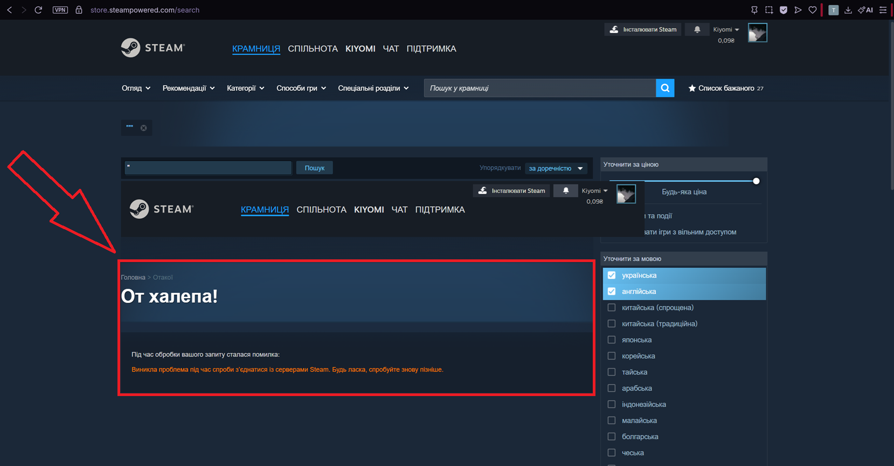

# BUG-001 — Store search returns a server error for a query consisting only of an odd number of double quotes

| | |
|---|---|
| **Severity** | Medium |
| **Priority** | Medium |
| **Reproducibility** | 5 out of 5 attempts |

**Environment:** Steam client (version 1784778118) and browsers Opera GX 133.0.5932.81, Microsoft Edge 150.0.4078.105; Windows 11 Home (build 22631); screen resolution 2560 x 1440 physical, Windows scaling 150%, browser viewport 1707 x 960 CSS pixels, page zoom 100%. Reproduces both in the client and in the browsers. Account interface language: Ukrainian. Language filters do not affect reproduction — verified both with a language filter enabled and with none applied.

## Steps to Reproduce

1. Open the Steam store (in a browser — store.steampowered.com; in the client — the "Крамниця" [Store] tab)
2. Enter any query in the store search box and go to the full search results page (in a browser this is store.steampowered.com/search)
3. In the search field on the results page, enter a single double quote: "
4. Press Enter

## Expected

The character is handled correctly — the query returns an empty result set, "Результатів вашого пошуку: 0" [Your search returned 0 results], as it does for the other special characters, or the character is escaped. No server error should occur.

## Actual

Instead of results, an error page is returned:
"От халепа! Під час обробки вашого запиту сталася помилка: Виникла проблема під час спроби з'єднатися із серверами Steam. Будь ласка, спробуйте знову пізніше."
[Oops! An error occurred while processing your request: There was a problem connecting to the Steam servers. Please try again later.]

## Severity and priority rationale

- **Severity: Medium** — the server returns an error instead of handling user input on a key store function; no correct result can be obtained for such a query.
- **Priority: Medium** — the scenario is rare (a query consisting entirely of quotes; a real user is unlikely to type this), but a server error on user input may indicate unescaped input, which is worth checking without delay.

## Notes

- the error is triggered only by a query consisting entirely of an odd number of double quotes. Variants tested:  
  — one double quote — error;  
  — three double quotes in a row — error;  
  — two double quotes in a row — handled correctly;  
  — a double quote before a word (quote + witcher) — handled correctly;  
  — a double quote after a word (witcher + quote) — handled correctly.
- the query is written into the page URL in encoded form (term=%22), so refreshing the page (F5) repeats the same query and returns the error again.
- the character breaks the request to the server — a possible sign of unescaped user input; the development team may want to check for injection.
- the consequences of this error are described separately: the results page layout breaking — BUG-002; search becoming unusable after the error — BUG-003.

## Attachments

