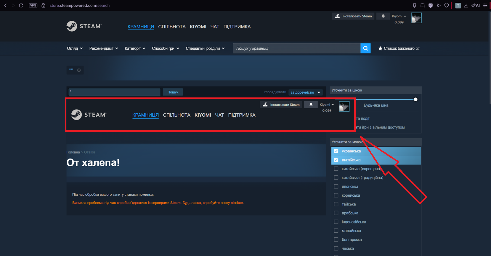

# BUG-002 — Site header is duplicated inside the search results area on a server error

| | |
|---|---|
| **Severity** | Low |
| **Priority** | Medium |
| **Reproducibility** | 5 out of 5 attempts |

**Preconditions:** a query that triggers a server error (see BUG-001)

**Environment:** browsers Opera GX 133.0.5932.81 and Microsoft Edge 150.0.4078.105; Windows 11 Home (build 22631); screen resolution 2560 x 1440 physical, Windows scaling 150%, browser viewport 1707 x 960 CSS pixels, page zoom 100%. Does not reproduce in the Steam client — browsers only. Account interface language: Ukrainian.

## Steps to Reproduce

1. Open the search results page in a browser (store.steampowered.com/search)
2. Enter a single double quote in the search field: "
3. Press Enter
4. Inspect the results area below the search field

## Expected

Only the error message is displayed in the results area. The site header (logo, the "Крамниця / Спільнота / Чат / Підтримка" [Store / Community / Chat / Support] menu, account block) remains in a single instance at the top of the page.

## Actual

A separate Steam error page is inserted into the results area in full, together with its own header. The site header is displayed twice: the normal one at the top of the page and a second copy inside the results body, overlapping the filter column on the right. Below the second header, the breadcrumbs "Головна > Отакої", the heading "От халепа!" [Oops!] and the error text are visible.

## Severity and priority rationale

- **Severity: Low** — a visual defect: the page layout is distorted, no data is lost, and the user is not directly prevented from working.
- **Priority: Medium** — the defect is visible to users on a public store page and looks like broken layout. It also presumably points to a cause beyond cosmetics: judging by the observed result, the server error response is inserted into the results container in full, without being processed. The same defect will appear on any other server error, not only the one described in BUG-001.

## Notes

- reproduces in at least two browsers (Opera GX, Edge) — the defect is not browser-specific.
- in the Steam client the header is not duplicated on the same error.
- the defect depends on how the request is made. Loading the URL directly (store.steampowered.com/search/?term=%22) returns the error page as the whole document, with the page title "Site Error" and no duplication. Submitting the same query from an already-open results page returns the same full error page as an AJAX response, which is injected into the results container as-is, including its own header. The response carries HTTP 200 OK (see BUG-001), so the front end has no signal that it is handling an error.

## Attachments

