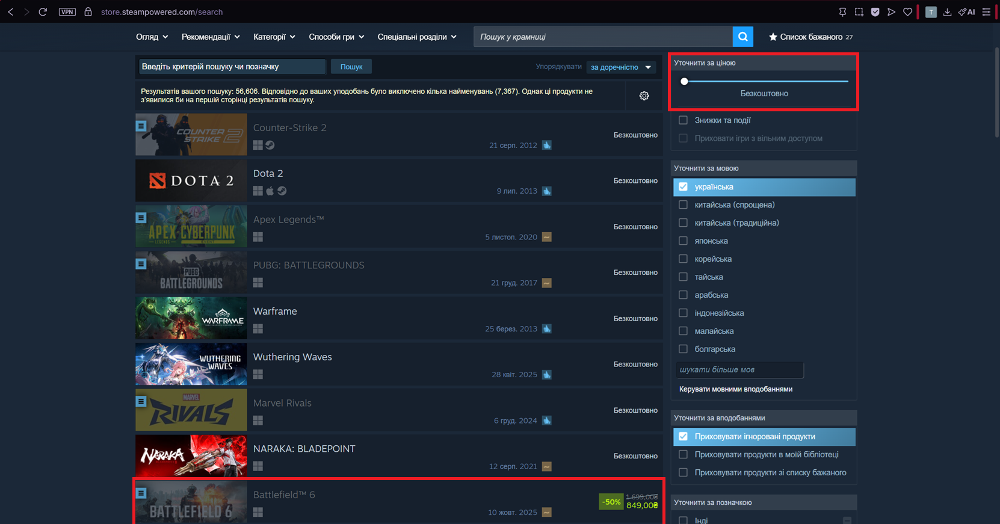

# BUG-004 — Price filter "Безкоштовно" [free] returns a paid game in the results

| | |
|---|---|
| **Severity** | Low |
| **Priority** | Medium |
| **Reproducibility** | 5 out of 5 attempts in the browsers, 5 out of 5 attempts in the Steam client. |

**Environment:** Steam client (version 1784778118) and browsers Opera GX 133.0.5932.81, Microsoft Edge 150.0.4078.105; Windows 11 Home (build 22631); screen resolution 2560 x 1440 physical, Windows scaling 150%, browser viewport 1707 x 960 CSS pixels, page zoom 100%. Account interface language: Ukrainian.

## Steps to Reproduce

1. Open the search results page (store.steampowered.com/search)
2. In the "Уточнити за ціною" [Refine by price] filter block, select "Безкоштовно" [free]
3. Review the results

## Expected

The results contain only products with a price of zero. No cards showing a price appear in the results.

## Actual

The results include a card for a paid game in the Battlefield series, namely Battlefield™ 6, and the card itself shows a discounted price of 849.00 UAH (−50% from 1,699.00 UAH).

## Severity and priority rationale

- **Severity: Low** — the filter works in general and only a limited number of incorrect entries reach the results; the price is visible to the user on the card and no data is lost.
- **Priority: Medium** — the defect is on a public store page and misleads users about the price of a product.

## Notes

- the game page contains a link to a free edition, Battlefield™ REDSEC. The presence of a free edition is presumably what causes the main paid card to fall under the "Безкоштовно" filter.
- question for the analyst — should a paid card appear in the results under the "Безкоштовно" filter when a separate free edition of the product exists? If this behaviour is considered expected, the card under this filter should show the price of the free edition rather than that of the paid one.

## Attachments

